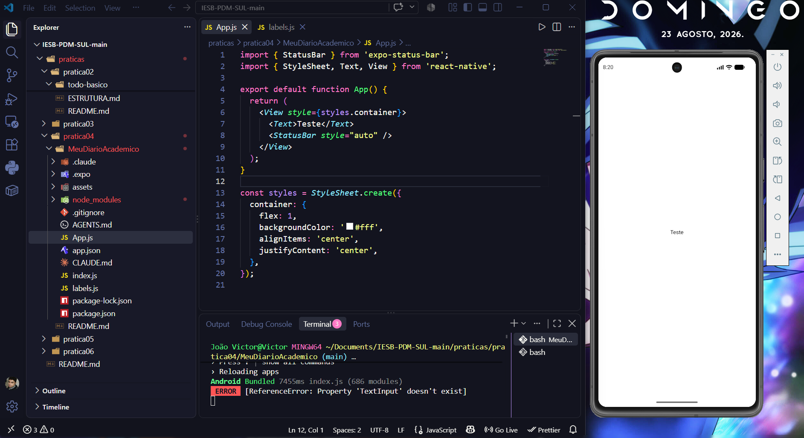
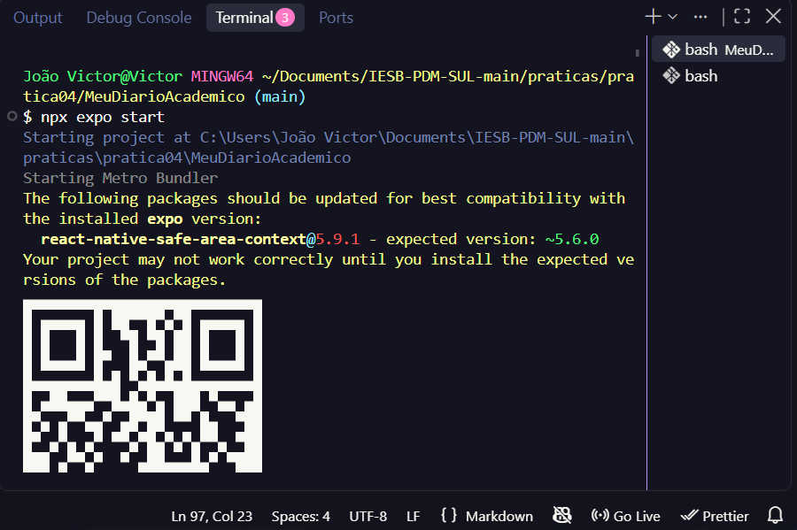
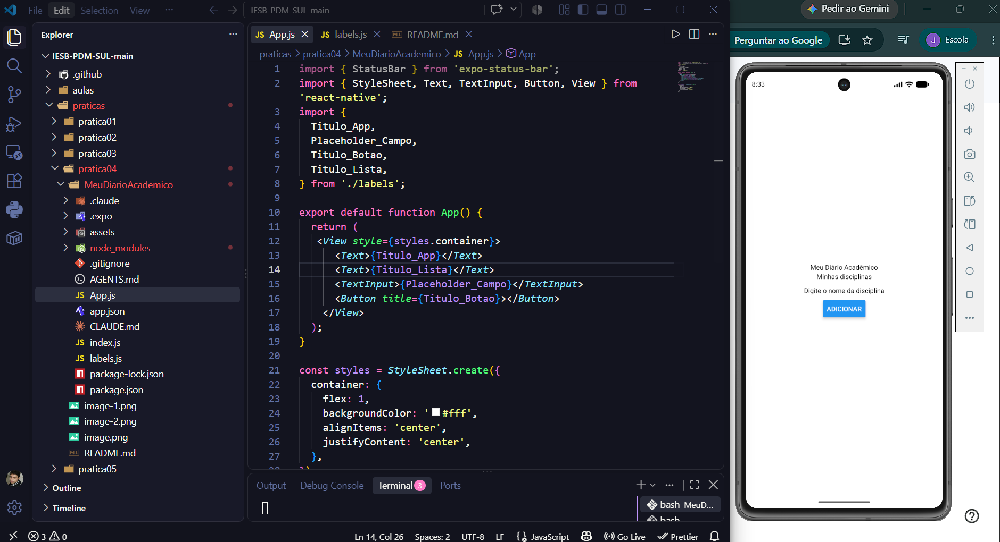
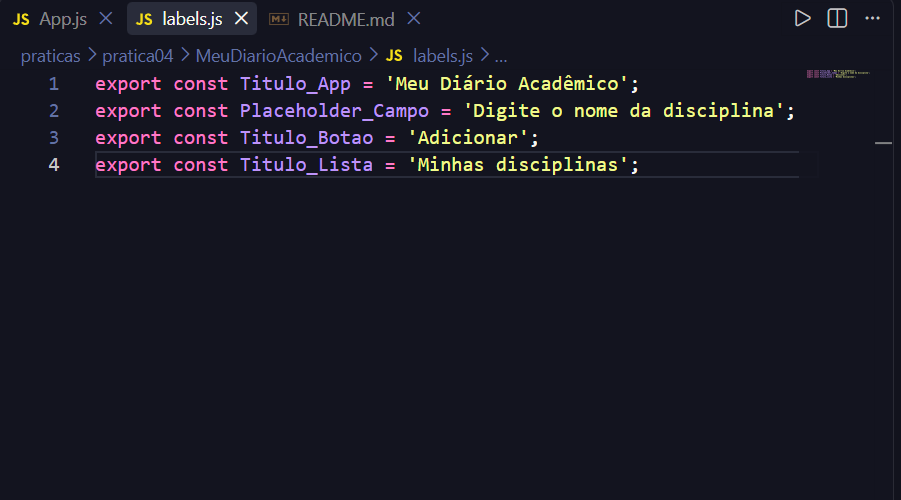
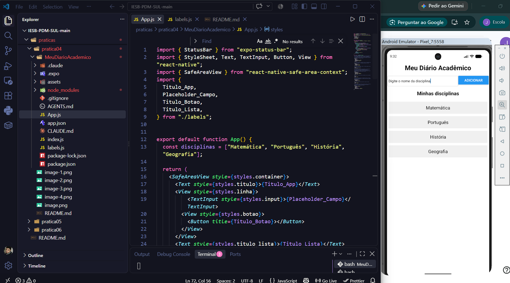

# Prints e comandos da atividade #

### Inicio do projeto e configurações iniciais.

## Execução do comando para rodar o projeto.

## Adicionando os primeiros elementos e tendo uma idea de como irá ficar

## Criação e exportação dos textos de titulos.

## Versão final do projeto

## Criação da pasta onde estará a atividade e do projeto
npx create-expo-app@latest MeuDiarioAcademico --template blank

## Mudança para a pasta criada
cd MeuDiarioAcademico

## Rodando a aplicação
npx expo start

## Instalação do safe area
npm install react-native-safe-area-context

## Criando a branch para a atividade
git checkout -b MeuDiarioAcademico

## Adicionando as mudanças
git add .

## Nomeando as alterações feitas
git commit -m "Enviando a atividade Meu Diario Academico"

## Comitando para a branch da atividade
git push origin MeuDiarioAcademico
