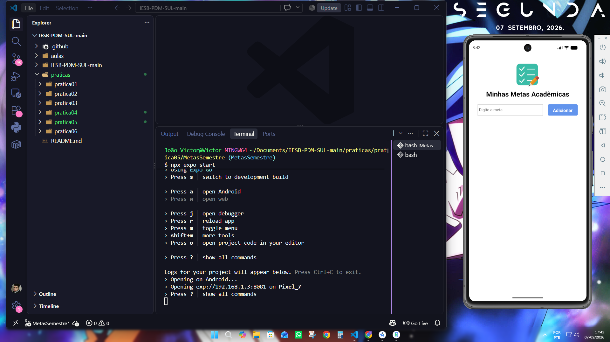
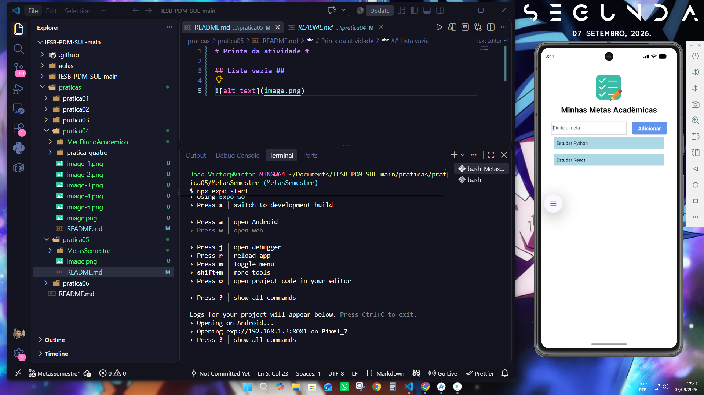
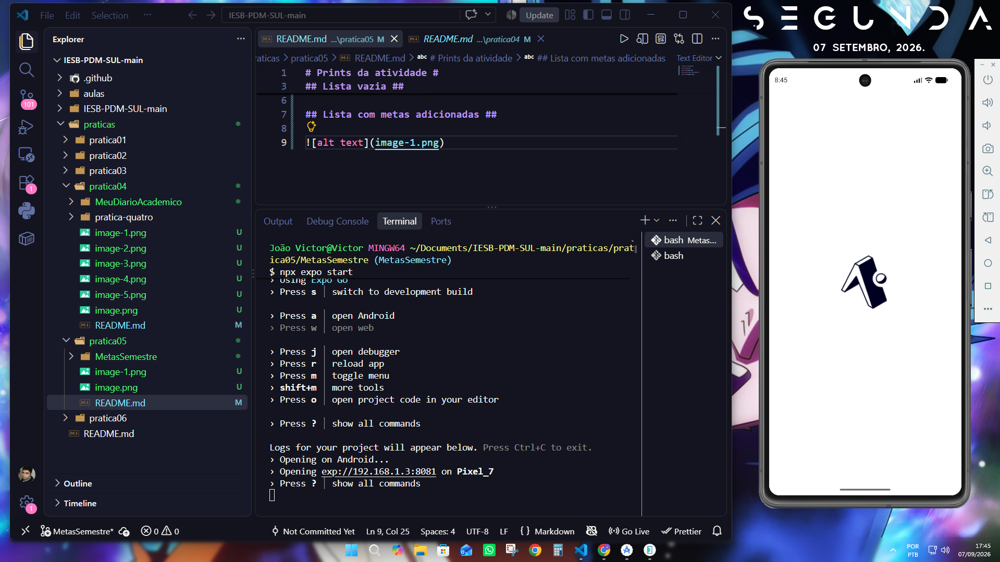
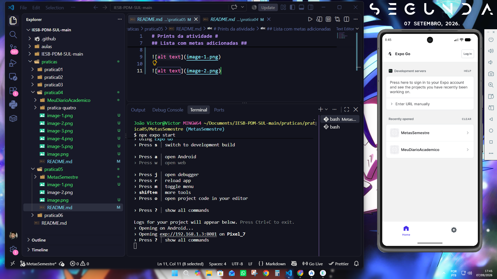
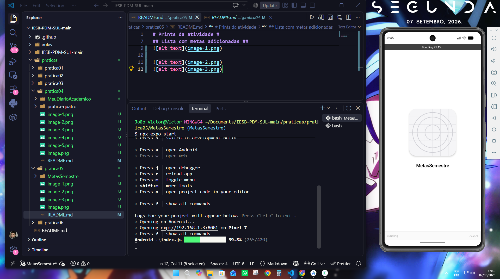
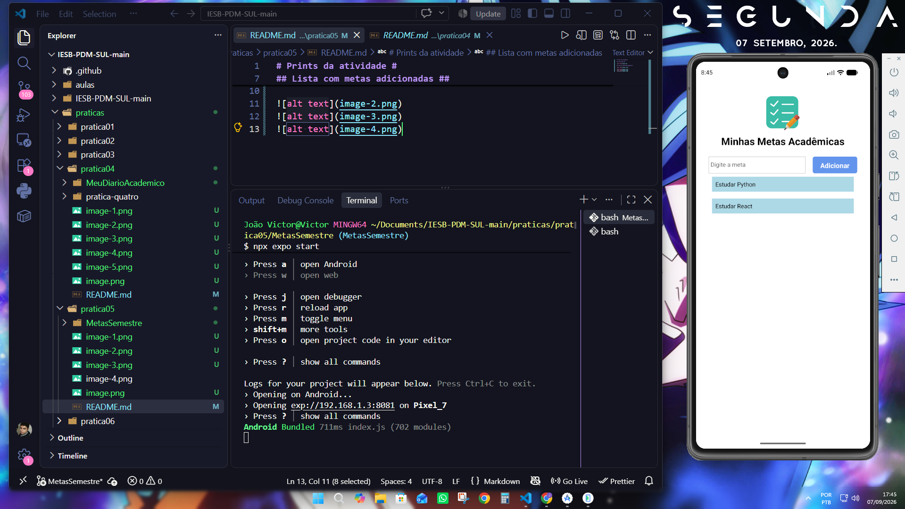
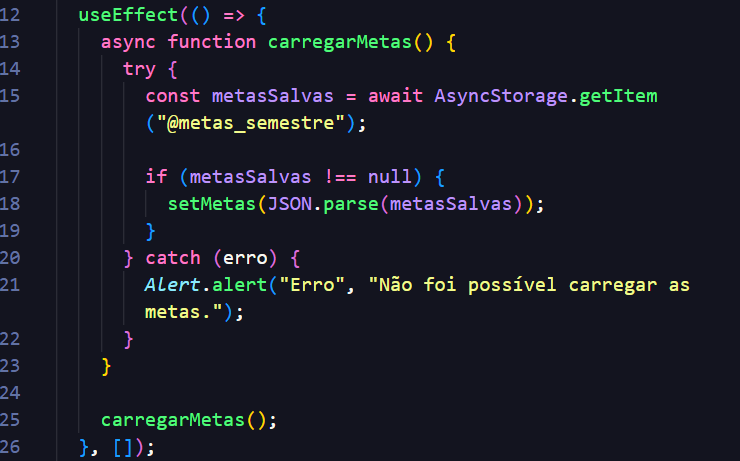
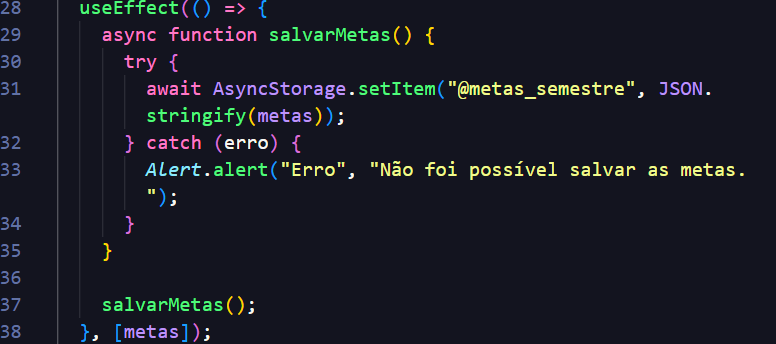

# Prints da atividade #

## Lista vazia ##

## Lista com metas adicionadas ##

## Reabrindo o app ##

## Explicação useEffect ##

Os dois useEffect estão em App.js

Esse carrega as metas salvas quando o aplicativo inicia. O [] significa que executa apenas na montagem do componente.

Esse salva as metas no AsyncStorage sempre que o array metas é alterado.

