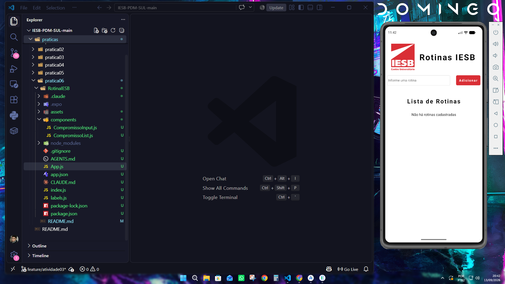
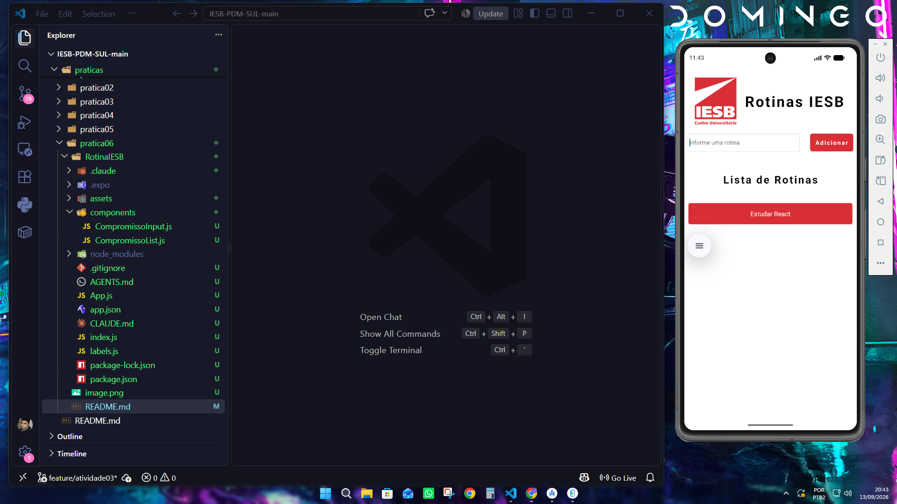
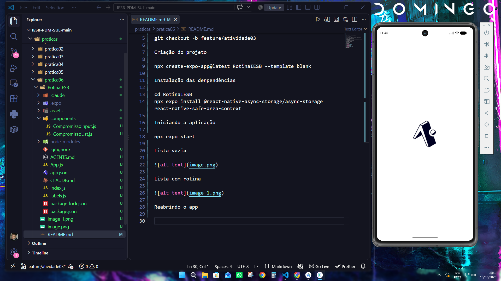
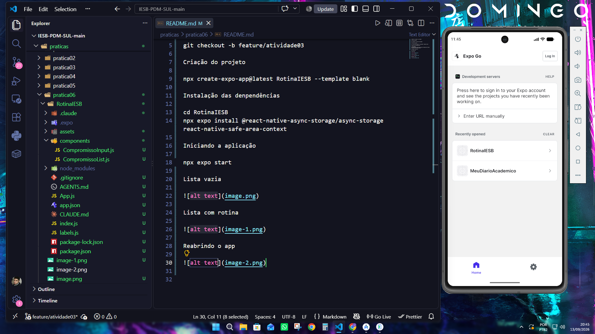
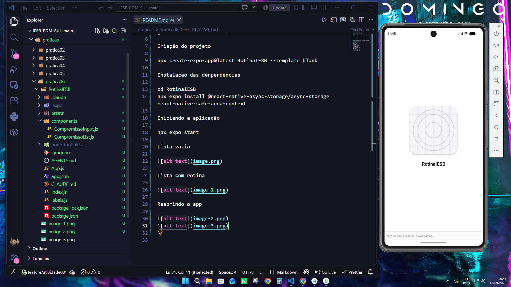
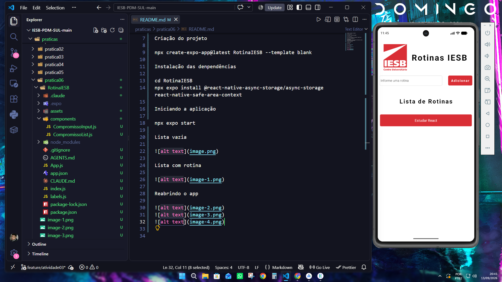

# Comandos utilizados na atividade #

## Criação da branch ##

git checkout -b feature/atividade03

## Criação do projeto

npx create-expo-app@latest RotinaIESB --template blank

## Instalação das denpendências ##

cd RotinaIESB
npx expo install @react-native-async-storage/async-storage react-native-safe-area-context

## Iniciando a aplicação ##

npx expo start

## Lista vazia ##

## Lista com item adicionado ##

## Reabrindo o app ##

## Mapa dos useEffect ##

Carga dos compromissos: primeiro useEffect. Utiliza AsyncStorage.getItem() para recuperar os compromissos salvos na chave @rotina_iesb_compromissos. Os dados são convertidos de JSON para um array com JSON.parse().

Salvamento dos compromissos: segundo useEffect. Utiliza AsyncStorage.setItem() para salvar a lista atualizada na mesma chave, convertendo os dados para JSON com JSON.stringify(). O salvamento ocorre quando a lista compromisso é alterada.

O estado carregando impede que os compromissos sejam salvos antes da conclusão da carga inicial.

## Lista de arquivos dos components e labels ##

CompromissoInput.js contendo o formulario

CompromissoList.js contendo a lista de rotinas

Labels contendo titulos e preechimentos para campos vazios.

